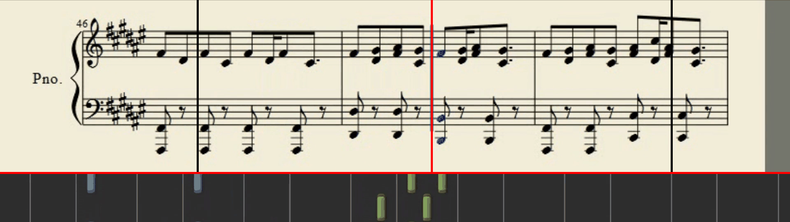

# sheet-music-extractor

[](https://github.com/tlifschitz/sheet-music-extractor/actions/workflows/ci.yml)

Reconstructs a printable PDF score from a piano-tutorial video — the kind that
scrolls a staff across the top of the frame while notes fall onto a keyboard
below.



## How it works

The hard part is not reading the staff — it is already a clean, high-contrast
render. The hard part is that a coloured playhead sits on top of the music, and
any single frame you grab has the cursor smeared across it.

The pipeline solves this with timing rather than inpainting:

1. **Find the staff.** A narrow strip at the left edge of the frame is checked
   for brightness. Bright means we are on white paper rather than a title card;
   the sharpest vertical brightness change inside that strip is the bottom edge
   of the sheet music. Everything below it — falling notes, keyboard, lyrics —
   is discarded.

2. **Track the playhead.** The staff is greyscale, so the cursor is the only
   strongly saturated thing in the crop. Converting to HSV and taking the
   column with peak mean saturation locates it in one pass, with no template
   matching or colour range to tune per video.

3. **Capture each half at the right moment.** As the playhead sweeps left to
   right, the **right** half of the staff is saved once the cursor passes 25% of
   the frame width, and the **left** half once it passes 85%. Neither capture
   has the cursor in it. `hstack`-ing the two halves reconstructs one complete,
   cursor-free staff line. This is the whole trick.

4. **Lay out pages.** Staff lines are scaled to A4 width at 300 DPI and stacked
   until the next one would overflow the page, then a new page starts.

A four-minute video takes about seven seconds to process.

## Usage

```bash
python -m venv venv
venv/bin/pip install -r requirements.txt

venv/bin/python video2sheet.py "videos/Some Tutorial.mp4"
```

The PDF lands in `sheets/` and opens automatically.

The heading is derived from the filename: `Coldplay - Yellow - Piano Tutorial
with Sheet Music` becomes a *Yellow* title with *Coldplay* underneath, with the
tutorial boilerplate dropped. Pass `--title`/`--artist` when that guess is
wrong. Multi-page scores are numbered in the bottom margin.

| Flag | |
|---|---|
| `--show` | live detector overlay while it runs; `q` aborts |
| `--plot` | playhead position over time, to see where tracking broke |
| `--dump-bars DIR` | also write each captured staff line as a PNG |
| `-o DIR` | output directory (default `sheets/`) |
| `--no-open` | do not open the PDF when finished |
| `--title` / `--artist` | override the heading, when the filename does not parse cleanly |

`youtube.py` fetches source videos via `yt-dlp` — either a single URL, or a
channel filtered by title regex or random sample:

```bash
venv/bin/python youtube.py "https://www.youtube.com/watch?v=<id>"
venv/bin/python youtube.py @SomeChannel --limit 50 --match "beatles" --list
```

Only the video stream is downloaded by default; the pipeline reads frames and
never touches the audio.

## Tests

```bash
venv/bin/python -m pip install -r requirements-dev.txt
venv/bin/pytest -q
```

The detector is covered by synthetic frames built with numpy — a white block
over a dark one for the staff boundary, a single saturated column for the
playhead — so the suite needs no video fixtures and runs in under a second.
The page-layout arithmetic and the URL handling in `youtube.py` are covered
the same way.

## Limitations

The detector is fitted to one channel's video layout — staff on top, notes
below, a saturated playhead, a light background. Videos shaped differently will
either find no staff boundary or capture nothing, and the constants at the top
of `video2sheet.py` are where you would adapt it.

It also reads only what is drawn on screen: no OMR, no MusicXML, no MIDI. The
output is an image-based PDF, so it is printable but not editable in notation
software.

Bar-line detection (splitting staff lines on musical boundaries rather than
screen boundaries) is prototyped in [`experiments/`](experiments/) but not
finished.

## Note on source material

Piano tutorial videos and the scores derived from them are usually copyrighted.
This repository contains no videos and no extracted scores — only the code. Use
it on material you have the right to use.

## License

MIT
