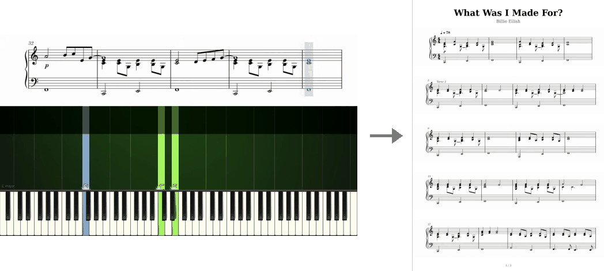

# sheet-music-extractor

[](https://github.com/tlifschitz/sheet-music-extractor/actions/workflows/ci.yml)

You play piano, you read sheet music, and one day you found an arrangement you
loved — in a YouTube tutorial. You tried to read the staff scrolling across the
top of the frame, pausing and rewinding, pausing and rewinding, and about two
bars in you thought: I just want this printed. But the creator never posted the
PDF.

That is what this is for. It watches the video and reconstructs the score as a
printable PDF.



One video in, a printable PDF out.

## How it works

The hard part is not reading the staff — it is already a clean, high-contrast
render. The hard part is that a coloured playhead sits on top of the music, and
any single frame you grab has the cursor smeared across it.


*Black: the two capture thresholds. Red: the tracked playhead, and the staff
boundary separating the music from the falling notes below. Each half lights
up at the moment it is grabbed — the right one while the playhead is still on
the left, the left one once it has moved past.*

The pipeline solves this with timing rather than inpainting:

1. **Find the staff.** A narrow strip at the left edge of the frame is checked
   for brightness. Bright means we are on white paper rather than a title card;
   the sharpest vertical brightness change inside that strip is the bottom edge
   of the sheet music. Everything below it — falling notes, keyboard, lyrics —
   is discarded.

2. **Track the playhead.** The staff is greyscale, so the cursor is the only
   strongly saturated thing in the crop. Converting to HSV and taking the
   column with peak mean saturation locates it in one pass, with no template
   matching or colour range to tune per video.

3. **Capture each half at the right moment.** As the playhead sweeps left to
   right, the **right** half of the staff is saved once the cursor passes 25% of
   the frame width, and the **left** half once it passes 85%. Neither capture
   has the cursor in it. `hstack`-ing the two halves reconstructs one complete,
   cursor-free staff line. This is the whole trick.

4. **Lay out pages.** Staff lines are scaled to A4 width at 300 DPI and stacked
   until the next one would overflow the page, then a new page starts.

Throughput is roughly 160 frames/second at 1080p and 1400 at 360p — the work
scales with pixel count. A four-minute clip takes anywhere from 6 seconds to a
minute and a half, depending on its resolution and frame rate.

For the reasoning behind the design — why inpainting and frame compositing
both fail here, why the thresholds are asymmetric, and where the technique
breaks — see [**The split-capture trick**](docs/the-split-capture-trick.md).

## Install

```bash
pipx install git+https://github.com/tlifschitz/sheet-music-extractor
```

Or from a clone, for hacking on it:

```bash
python -m venv venv
venv/bin/python -m pip install -e ".[dev]"
```

There is no system dependency to install: the project uses the headless
OpenCV build, so it installs on a bare Linux box the same as on a Mac.

## Usage

```bash
video2sheet "videos/Some Tutorial.mp4"
```

The PDF lands in `./sheets/`, created wherever you run the command, and opens
automatically.

The heading is derived from the filename: `Coldplay - Yellow - Piano Tutorial
with Sheet Music` becomes a *Yellow* title with *Coldplay* underneath, with the
tutorial boilerplate dropped. Pass `--title`/`--artist` when that guess is
wrong. Multi-page scores are numbered in the bottom margin.

Staff lines are spread evenly across the pages and the leftover height is
distributed between them, so a page never ends with a gap that looks like a
line failed to fit. `--dense` turns that off and packs each page as full as
it goes, which trades even pages for fewer page turns.

| Flag | |
|---|---|
| `--debug-gif PATH` | an animated overlay of what the detector saw, to diagnose a video |
| `--plot` | playhead position over time, to see where tracking broke |
| `--dump-bars DIR` | also write each captured staff line as a PNG |
| `-o DIR` | output directory (default `./sheets`, relative to where you run) |
| `--no-open` | do not open the PDF when finished |
| `--title` / `--artist` | override the heading, when the filename does not parse cleanly |
| `--dense` | pack pages as full as they go, instead of spreading lines evenly |

`video2sheet-fetch` pulls source videos via `yt-dlp` — either a single URL, or
a channel filtered by title regex or random sample:

```bash
video2sheet-fetch "https://www.youtube.com/watch?v=<id>"
video2sheet-fetch @SomeChannel --limit 50 --match "beatles" --list
```

Only the video stream is downloaded by default; the pipeline reads frames and
never touches the audio.

## Tests

```bash
venv/bin/python -m pip install -e ".[dev]"
venv/bin/pytest -q
```

The detector, the page-layout arithmetic and the fetcher's URL handling are
covered by synthetic frames built with numpy — a white block over a dark one
for the staff boundary, a single saturated column for the playhead.

On top of that, an end-to-end test synthesises a short tutorial video with
`cv2.VideoWriter` — bright paper, a dark note band, a saturated cursor
sweeping across — and runs the real pipeline over it. Its load-bearing
assertion is that no captured staff line contains a saturated column: if the
playhead ends up inside one, the split-capture timing failed. A second video
starts with the playhead already past both thresholds, pinning the state
machine against a bug that once stitched two halves grabbed at the same
instant.

Nothing is checked in and the whole suite runs in about three seconds.

## Limitations

The detector is fitted to one channel's video layout — staff on top, notes
below, a saturated playhead, a light background. Videos shaped differently will
either find no staff boundary or capture nothing, and the constants at the top
of `sheet_music_extractor/video2sheet.py` are where you would adapt it.

It also reads only what is drawn on screen: no OMR, no MusicXML, no MIDI. The
output is an image-based PDF, so it is printable but not editable in notation
software.

Bar-line detection (splitting staff lines on musical boundaries rather than
screen boundaries) is prototyped in [`experiments/`](experiments/) but not
finished.

## Note on source material

Piano tutorial videos and the scores derived from them are usually copyrighted.
This repository ships no videos and no usable scores — only the code. The
images above are low-resolution illustrations: the page shown is about a
seventh of print size, far too small to read or play from. Use the tool on
material you have the right to use.

## License

MIT
