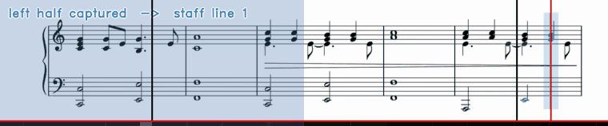

# The split-capture trick

*How this project reconstructs a clean score from a video that never shows one.*

## The problem

Piano tutorial videos scroll a staff across the top of the frame while notes
fall onto a keyboard below. The staff is already a clean, high-contrast
render — far better than a photograph of paper. Reading it is not the hard
part.

The hard part is the playhead. A coloured cursor sweeps left to right across
the staff, and it is drawn *on top of* the music. Grab any single frame and
some bars are obscured by a translucent bar of colour.



So the question is not "how do I read the staff", it is "how do I get a
picture of the staff with nothing on top of it".

## Three approaches that do not work

**Inpaint the cursor away.** Detect the coloured column, then reconstruct what
is under it. This is exactly the situation where inpainting fails: the missing
region is thin and vertical, and the content underneath — note stems, beams,
ledger lines — is also thin and vertical. The algorithm has no way to
distinguish a stem it should restore from a gap it should leave blank. You get
plausible-looking music that is wrong, which is worse than obviously broken
music.

**Composite across frames.** Take the median of many frames, so the moving
cursor averages out. This works in principle, but the staff scrolls: two
frames taken far enough apart to have the cursor in different places also have
*different music* in them. You would have to register them first, and
registration is a harder problem than the one you started with.

**Wait for a frame with no cursor.** There isn't one. The cursor is on screen
whenever the music is.

## The observation

Within a single sweep, the staff does not move. The video advances one
screenful of music at a time: the staff is redrawn, the cursor crosses it left
to right, and only then does the next screenful appear.

That means every frame in a sweep shows *the same music*, with the cursor in a
different place. And if the cursor is on the left, the right half is clean. If
the cursor is on the right, the left half is clean.

**Neither half needs to be clean at the same time.** They only need to be
clean at *some* time, and we can remember them.

## The trick

Two captures per sweep, at two different moments:

| When the cursor passes… | Capture | Why it is clean |
|---|---|---|
| **25%** of the frame width | the **right** half | the cursor is still on the left |
| **85%** of the frame width | the **left** half | the cursor has moved past it |

`np.hstack` the two halves and you have a complete staff line with the cursor
in neither. Not repaired, not reconstructed, not interpolated — never
occluded in the first place.

```python
if state == 1 and bar_position > th1:
    cut_right = staff[:, mid:].copy()      # cursor still on the left
    state = 2
if state == 2 and bar_position > th2:
    cut_left = staff[:, :mid].copy()       # cursor now past the middle
    merged = np.hstack((cut_left, cut_right))
    state = 3
```

The seam is exact. Because the staff is static within a sweep, the two halves
come from the same rendering of the same music — the left edge of one lines up
with the right edge of the other to the pixel, with nothing duplicated and
nothing lost.

## Why 25% and 85%

The thresholds are asymmetric, and deliberately so.

The right-half capture fires early, at 25%. It could fire at 0%, but the
cursor is not reliably detectable until it has moved clear of the left margin,
and the staff needs a frame or two to settle after being redrawn.

The left-half capture fires late, at 85%, and not at 100%. Waiting for the
cursor to reach the very edge risks missing the moment entirely: the sweep
ends and the next screenful is drawn between two sampled frames. At 85% there
is comfortable margin, and the cursor is already well clear of the left half.

## Finding the playhead without tuning colours

The obvious way to locate a coloured cursor is a colour range in HSV, or
template matching. Both need per-video tuning, because every channel picks its
own cursor colour.

There is a simpler invariant: **the staff is greyscale.** Printed music is
black on white. The cursor is the only strongly saturated thing anywhere in
the crop, whatever colour the channel chose.

So: convert to HSV, take the mean of the saturation channel down each column,
smooth slightly, and the peak is the cursor.

```python
hsv = cv2.cvtColor(frame, cv2.COLOR_BGR2HSV)
column_saturation = np.mean(hsv[:, :, 1], axis=0)
x = np.argmax(np.convolve(column_saturation, kernel, mode="same"))
```

One pass, no per-video colour tuning, works for a blue cursor or a red one. If
the peak never rises above a floor, there is no cursor on screen and the frame
is skipped — which doubles as the check for "is this even a staff".

## Finding where the staff ends

Everything above assumes we know which part of the frame is sheet music and
which is falling notes. That boundary is found the same way — by looking for
the simplest invariant rather than the most obvious feature.

Only a narrow strip at the **left edge** of the frame is inspected. The mean
brightness of that strip answers "are we looking at white paper at all, or at
a title card?". Within it, the row of sharpest brightness change is the bottom
edge of the sheet music, because paper is bright and the falling-note area is
dark.

Checking a 20-pixel strip instead of the whole frame is not just faster; it is
*more* robust. The left margin of a staff is empty — no notes, no lyrics, no
piano roll — so the brightness profile there is close to a step function.

## Where it breaks

The technique rests on one assumption: **the staff is static within a sweep.**
When that holds, the seam is perfect. When it does not, the two halves come
from different music and the stitch is visibly wrong.

It does not hold if the video scrolls continuously rather than a screenful at
a time. Those videos need an entirely different approach.

The brightness threshold is the other weak point. It is a fixed constant, and
on one test video the paper measured 228.6 against a threshold of 230 — the
detector survived by 1.4 points. A video with slightly greyer paper fails
completely, and the honest fix is to calibrate the threshold from the first
few frames instead of hardcoding it.

## What it costs

Every frame costs one HSV conversion of the staff crop, one column-wise mean,
and one 20-pixel-wide grayscale strip. That is linear in pixel count, and it
shows:

| Source | Frames | Time | Throughput |
|---|---|---|---|
| 640×360, 30 fps | 8521 | 5.9 s | 1434 frames/s |
| 1920×1080, 24 fps | 5737 | 35.6 s | 161 frames/s |
| 1920×1080, 60 fps | 13891 | 84.8 s | 164 frames/s |

Single-threaded, no GPU. 1080p has nine times the pixels of 360p and runs
about nine times slower, which is the expected shape: nothing in the detector
is doing anything clever with the extra resolution, and downscaling before
detection would buy most of that time back.

The expensive-looking part of the problem, reconstructing occluded music,
turned out to cost nothing at all. It was avoided rather than solved.
