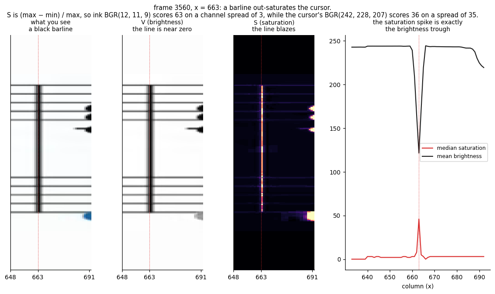

# Why split capture

*Why this project reconstructs the score by timing rather than by repair.*

Piano tutorial videos scroll a staff across the top of the frame while notes
fall onto a keyboard below, with a coloured cursor drawn on top of the music.
Grab any single frame and some bars sit under a bar of colour.

This project never repairs them. It grabs the right half of the staff while the
cursor is still on the left, the left half once the cursor has moved past, and
stitches the two — each half was clean at the moment it was taken. The README's
[How it works](../README.md#how-it-works) shows that happening, frame by frame,
with every signal the detector uses plotted alongside.

What follows is the argument rather than the mechanism. The question was never
"how do I read the staff" — the staff is already a clean, high-contrast render,
far better than a photograph of paper. The question is "how do I get a picture
of the staff with nothing on top of it".

## Three approaches that do not work

**Inpaint the cursor away.** Detect the coloured column, then reconstruct what
is under it. This is exactly the situation where inpainting fails: the missing
region is thin and vertical, and the content underneath — note stems, beams,
ledger lines — is also thin and vertical. The algorithm has no way to
distinguish a stem it should restore from a gap it should leave blank. You get
plausible-looking music that is wrong, which is worse than obviously broken
music.

**Composite across frames.** Take the median of many frames, so the moving
cursor averages out. This works in principle, but the staff scrolls: two
frames taken far enough apart to have the cursor in different places also have
*different music* in them. You would have to register them first, and
registration is a harder problem than the one you started with.

**Wait for a frame with no cursor.** There isn't one. The cursor is on screen
whenever the music is.

## The observation

Within a single sweep, the staff does not move. The video advances one
screenful of music at a time: the staff is redrawn, the cursor crosses it left
to right, and only then does the next screenful appear.

That means every frame in a sweep shows *the same music*, with the cursor in a
different place. And if the cursor is on the left, the right half is clean. If
the cursor is on the right, the left half is clean.

**Neither half needs to be clean at the same time.** They only need to be
clean at *some* time, and we can remember them.

The seam is exact. Because the staff is static within a sweep, the two halves
come from the same rendering of the same music — the left edge of one lines up
with the right edge of the other to the pixel, with nothing duplicated and
nothing lost.

## Why 25% and 85%

The thresholds are asymmetric, and deliberately so.

The right-half capture fires early, at 25%. It could fire at 0%, but the
cursor is not reliably detectable until it has moved clear of the left margin,
and the staff needs a frame or two to settle after being redrawn.

The left-half capture fires late, at 85%, and not at 100%. Waiting for the
cursor to reach the very edge risks missing the moment entirely: the sweep
ends and the next screenful is drawn between two sampled frames. At 85% there
is comfortable margin, and the cursor is already well clear of the left half.

## Where it breaks

The technique rests on one assumption: **the staff is static within a sweep.**
When that holds, the seam is perfect. When it does not, the two halves come
from different music and the stitch is visibly wrong.

It does not hold if the video scrolls continuously rather than a screenful at
a time. Those videos need an entirely different approach.

The brightness threshold is the other weak point. It is a fixed absolute
constant, so how much room it leaves depends entirely on how a channel renders
paper. Across the eight videos this was developed against, seven measure 247
to 253 against a floor of 230 — but *The Run And Go* measures 232.8, a margin
of under three points. A channel whose paper is a shade greyer fails
completely, and the honest fix is to calibrate the threshold from the first
few frames instead of hardcoding it.

The third weak point is inside the invariant itself. "The staff is greyscale,
so the cursor is the only saturated thing" is true of ink and paper, but HSV
saturation is `(max − min) / max`, and that denominator collapses on dark
pixels. A barline is black, so two or three units of compression noise across
its channels read as strong colour:

The line scores 63 on a channel spread of three units; the cursor beside it
scores 36 on a spread of thirty-five. The barline is an order of magnitude less
colourful and reads nearly twice as saturated — and none of it is visible on
screen. Measured over one video, something on the page comes within 50% of the
cursor's peak on roughly one frame in five.

It does not break the detector, for two reasons. A barline is a pixel or two
wide, so the smoothing kernel dilutes it while leaving the cursor's forty-pixel
band intact; and the argmax only has to pick the taller of the two, never to
classify either. But it is why the cursor clears its rivals by a factor of two
rather than a factor of ten, and why a plain saturation threshold could not
replace the argmax.

Taking the median down each column instead of the mean would be the more robust
statistic — it rejects the coloured marks in the notation outright, and on the
same video it never falls below 1.76× separation where the mean touches 1.00×.
It is not used because it costs twenty times as much per frame, roughly
doubling the runtime in the table below, and because it needs the cursor to
cover more than half the column: at 76% here, that is a cliff rather than a
slope. Clipping saturation before averaging buys most of the robustness for
four times the cost instead of twenty, and remains the obvious thing to try
first if a video ever does get this wrong.

## What it costs

Every frame costs one HSV conversion of the staff crop, one column-wise mean,
and one 20-pixel-wide grayscale strip. That is linear in pixel count, and it
shows:

| Source | Frames | Time | Throughput |
|---|---|---|---|
| 640×360, 30 fps | 8521 | 5.9 s | 1434 frames/s |
| 1920×1080, 24 fps | 5737 | 35.6 s | 161 frames/s |
| 1920×1080, 60 fps | 13891 | 84.8 s | 164 frames/s |

Single-threaded, no GPU. 1080p has nine times the pixels of 360p and runs
about nine times slower, which is the expected shape: nothing in the detector
is doing anything clever with the extra resolution, and downscaling before
detection would buy most of that time back.

The expensive-looking part of the problem, reconstructing occluded music,
turned out to cost nothing at all. It was avoided rather than solved.
